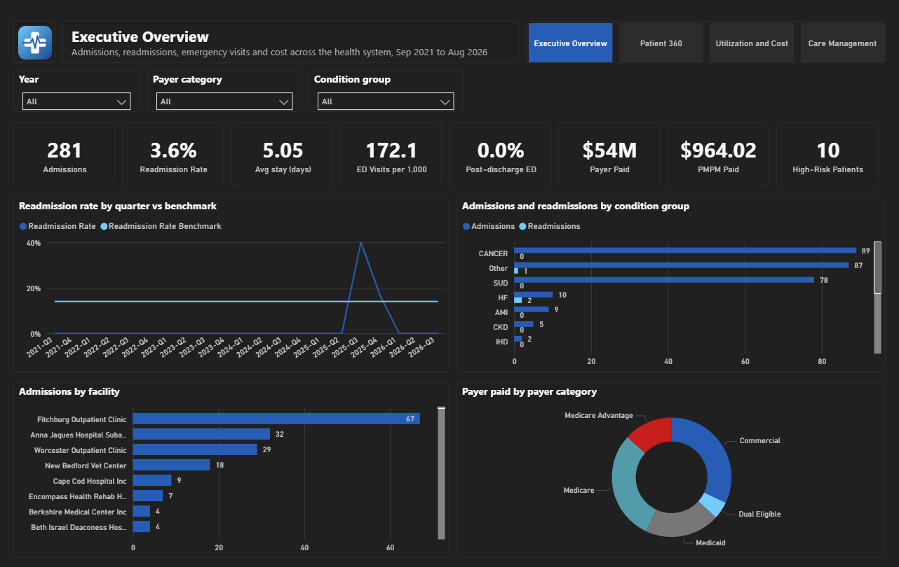
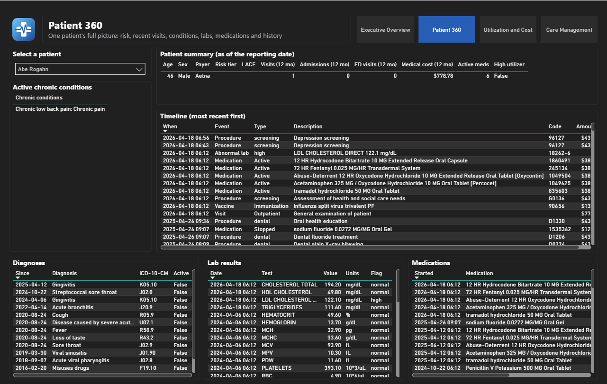
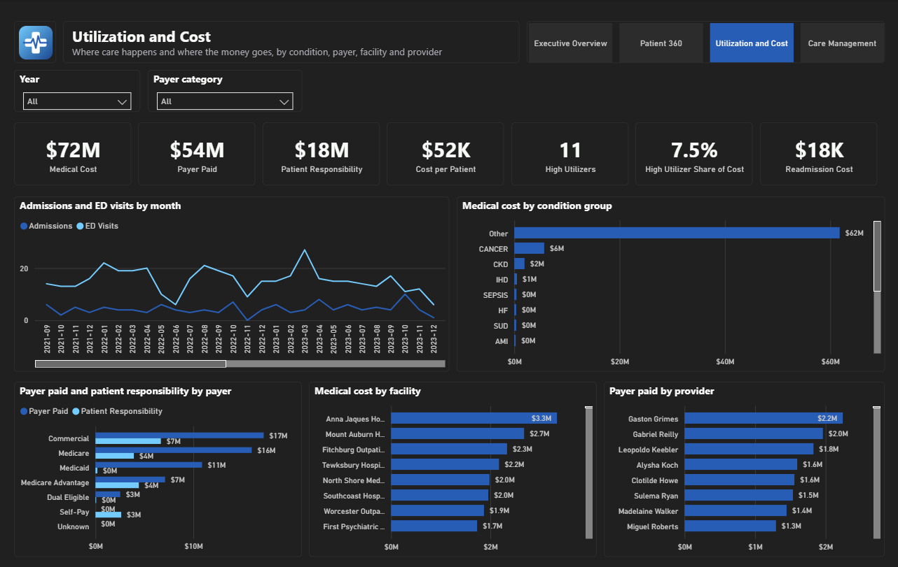
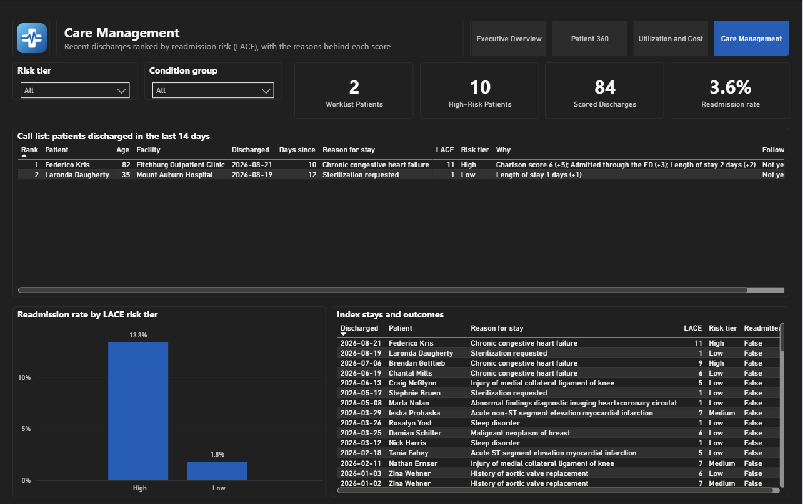

# Healthcare Patient 360 and Predictive Care Analytics Platform

An end-to-end analytics platform for a regional health system, built on Databricks with Power BI on top.

It takes clinical data from Epic's FHIR API and a full synthetic health system's records and claims, brings them into one place, maps the codes so they line up, and turns them into the numbers a hospital actually runs on: readmissions, emergency department use, length of stay, cost per member per month, and a daily call list of the patients most likely to come back.

> **About the data.** Epic Clarity and production Epic FHIR endpoints need an Epic customer environment, so this project uses Epic's public **FHIR sandbox** for the real API integration and **Synthea**, a synthetic patient generator, for volume: 1,000 patients with 10 years of history, clinical records and claims. No real patient data is used anywhere.

---

## The problem this solves

Hospitals sit on a lot of data and still struggle to answer simple questions.

**1. Patients keep coming back.** Medicare's Hospital Readmissions Reduction Program cuts payments by up to 3% when too many patients return within 30 days after a stay for heart failure, a heart attack, pneumonia, COPD and a few other conditions. Knowing the rate after the fact doesn't help. Knowing *which patients* are likely to return, while they're still on the ward or fresh out the door, does.

**2. The emergency department fills up with avoidable visits.** People with a chronic condition and no easy way to see their own doctor end up in the ED. Each visit costs far more than a clinic appointment, and the pattern repeats.

**3. Nobody has the whole picture of a patient.** Visits live in the EHR, bills live with the payer, lab results live somewhere else. A care manager calling a patient after discharge has to open several systems to learn what happened.

**4. The data doesn't line up.** Clinical systems speak SNOMED and LOINC, billing speaks ICD-10-CM and CPT. Until those are mapped to each other, you can't count how many heart failure admissions you had, let alone what they cost.

**5. Measures mean different things in different reports.** One team's readmission rate includes planned surgery, another's doesn't. Both are on a slide, and they disagree.

This project takes those 5 problems in order: bring the data together, map the codes, define each measure once, and put the result in front of the people who act on it.

## Who it's for, and what they get

| Who | What they use it for |
|---|---|
| **Executives** | One page with the numbers the board asks about: admissions, readmission rate against a national benchmark, average length of stay, ED visits per 1,000 patients, payer paid and per-member-per-month cost, and how each breaks down by condition, facility and payer. |
| **Care managers and discharge nurses** | A ranked call list of patients discharged in the last 14 days, with each patient's risk score explained in plain language: "Charlson score 6 (+5); Admitted through the ED (+3); Length of stay 2 days (+2)". Highest risk first, so the day starts with the right patient. |
| **Clinicians** | A single patient page: risk, the last 12 months of visits and cost, chronic conditions, active medications, abnormal labs, and a full timeline of everything that happened, newest first. |
| **Finance and population health** | Where the money goes, by condition, payer, facility and provider, and what share of it goes to the small group of high utilizers. |
| **Data teams** | Every transformation is readable SQL in the repo, every measure is defined once, and the whole workspace is rebuilt from code. |

## How the data moves

```text
Epic FHIR sandbox ─┐
Synthea FHIR ──────┼─► Landing zone ─► BRONZE ─► SILVER ─► GOLD ─► Power BI
Synthea CSVs ──────┤   (UC Volume)     raw,      typed,     star schema,
Reference CSVs ────┘                   as-is     mapped,    KPIs,
                                                 checked    Patient 360
```

- **Landing zone.** Files arrive exactly as the source produced them: FHIR NDJSON and CSV, organized by run, in a Unity Catalog Volume.
- **Bronze.** Loaded as-is, every column as text, plus a note of which file, run and load each row came from. Nothing is cleaned here, so nothing breaks when a source changes.
- **Silver.** One SQL file per entity. Types are set, duplicates removed, codes mapped through lookup tables (SNOMED to ICD-10-CM, CPT, payer type, lab reference ranges), and 38 data quality checks record anything that looks wrong without dropping rows.
- **Gold.** A star schema for reporting, plus KPI tables, the readmission and risk-score table, and the Patient 360 tables. Gold stores counts and sums, never rates, so a rate means the same thing on every page.
- **Power BI.** A model over Gold where the measures are simple sums and divisions, and 4 report pages.

Each layer is explained in detail in the [docs](#documentation).

## What it's built with

| | |
|---|---|
| **Databricks Free Edition** | The whole platform: serverless compute, SQL warehouse, no cluster management |
| **Unity Catalog** | Catalog, schemas and the Volume that holds the landing files |
| **Lakeflow Declarative Pipelines** | One pipeline runs Bronze, Silver and Gold; Databricks works out the order from the SQL |
| **Delta Lake** | The table format behind every Bronze, Silver and Gold table |
| **Auto Loader** | Picks up only the new files in the landing zone on each run |
| **SQL** | Every transformation, so the logic can be read and explained without knowing Spark |
| **Databricks Asset Bundles** | The pipeline and the daily job defined as code; nothing created by hand in the workspace |
| **GitHub Actions** | Runs the reference data tests, validates the bundle, and deploys on every push to `main` |
| **Power BI (PBIP)** | The semantic model and report saved as text files, so dashboard changes show up in git |
| **Python and PowerShell** | Only at the edges: pull from the Epic API, generate the population, upload the files |
| **Epic on FHIR sandbox** | Real OAuth backend service authentication and real FHIR R4 resources |
| **Synthea** | 1,000 synthetic patients with 10 years of history, exported as both FHIR and CSV |

## The dashboards

Four pages, each answering one question.

### Executive Overview: how are we doing?



Admissions, readmission rate against the national benchmark, average length of stay, ED visits per 1,000, post-discharge ED rate, payer paid, per-member-per-month cost and high-risk patients, with trends and breakdowns by condition group, facility and payer.

### Patient 360: what's going on with this patient?



Pick a patient and see their risk score, the last 12 months of visits and cost, chronic conditions, active medications, abnormal labs and a full timeline of visits, diagnoses, procedures, medications, labs and vaccines.

### Utilization and Cost: where does the money go?



Total cost, payer paid, patient responsibility, cost per patient and the share of spend going to high utilizers, broken down by condition group, payer category, facility and provider.

### Care Management: who do we call today?



Patients discharged in the last 14 days, ranked by their LACE readmission risk score, with the reasons behind each score in plain language, plus how the readmission rate actually turned out by risk tier.

## The approach: build it in phases

### Phase 1: a working platform, kept simple (done)

The goal was something that runs end to end and can be explained line by line, rather than something clever.

- Epic FHIR sandbox connection with backend OAuth, pulling real R4 resources
- 1,000 synthetic patients with 10 years of history, records and claims
- Lookup tables for the code mapping, with the ICD-10-CM codes checked against the official CMS file
- Bronze, Silver and Gold as readable SQL: 1 Python file in the whole pipeline
- Readmission measure built the way CMS does it: index stays, planned admissions excluded, 30-day follow-up, and a LACE risk score with the reason behind it
- A daily job that refreshes everything and then checks it, failing loudly with a clear message when something is off
- The workspace defined as code, deployed by CI
- A Power BI project with 4 pages

What it produced on the current data: 281 admissions, 3.6% 30-day readmission rate, 5.05 days average length of stay, 172 ED visits per 1,000 patients per year, $54M paid by payers and about $964 per member per month.

Phase 1 uses Synthea's data as generated, which keeps the loading simple and honest. The trade-off is that synthetic patients rarely come back to hospital, so readmissions look low.

### Phase 2: make it realistic

- Calibrate readmission and ED rates to published national figures, so the measures can be judged against real benchmarks
- Clarity-style source tables, closer to what a real Epic extract looks like
- Detailed billing: charge lines, adjustments, denials and remittances
- Deliberate data quality problems (duplicate patients, missing codes, late-arriving records) so the pipeline's checks earn their place
- Patient matching across sources, slowly changing dimensions for history, and row-level security

### Phase 3: prediction and language

- A readmission risk model trained on the Gold tables, compared against the LACE score it would replace
- Explanations of each prediction, so a nurse can see why a patient is flagged
- Generated patient summaries for the care management page

## Documentation

1. [Data sourcing strategy](docs/01_data_sourcing_strategy.md): where the data comes from and why
2. [Epic sandbox setup](docs/02_epic_sandbox_setup.md): register an app, generate keys, pull FHIR data
3. [Landing zone and Bronze](docs/03_databricks_landing_and_bronze.md): the Volume and the raw layer
4. [Problem statement and requirements](docs/04_requirements.md): the measures, the definitions and the decisions behind them
5. [Silver](docs/05_silver.md): the transformation pattern and the 14 tables
6. [Gold](docs/06_gold.md): the star schema, KPI definitions and readmission logic
7. [Deployment and CI](docs/07_deploy_and_ci.md): the bundle, the daily job and the checks
8. [Power BI](docs/08_power_bi.md): connecting the report, the model and the pages
9. [Project status and layout](docs/09_project_status.md): what's done, what's next, and where everything lives

---

**Author:** Narendar
